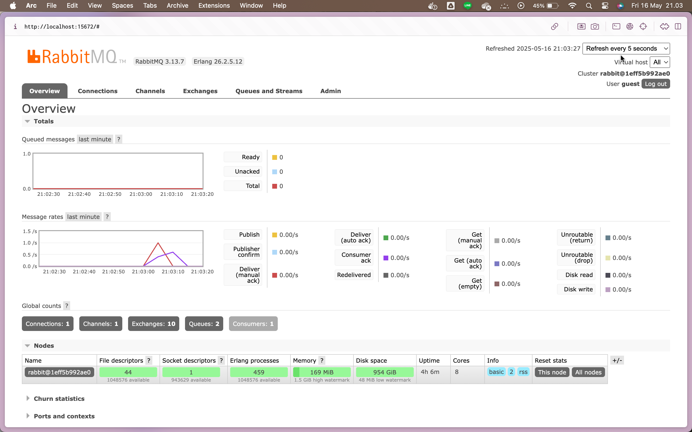

# subscriber-module9

a. What is AMQP?

AMQP (Advanced Message Queuing Protocol) adalah protokol komunikasi terbuka yang dirancang untuk sistem message broker seperti RabbitMQ. Protokol ini memungkinkan aplikasi yang berbeda untuk saling bertukar pesan secara andal dan terstruktur, tanpa harus langsung terhubung satu sama lain. AMQP mendukung fitur seperti antrian pesan, routing, dan manajemen antrian, yang sangat berguna dalam arsitektur sistem terdistribusi dan mikroservis.

b. What does it mean? guest:guest@localhost:5672

`guest:guest@localhost:5672` adalah bagian dari URL koneksi AMQP yang menunjukkan kredensial dan alamat server message broker. `guest:guest` berarti username dan password-nya adalah "guest", sedangkan `localhost` menunjukkan bahwa broker dijalankan di mesin lokal (komputer kita sendiri), dan `5672` adalah port default yang digunakan oleh RabbitMQ untuk komunikasi AMQP. Dengan demikian, kombinasi ini mengatur agar publisher atau subscriber bisa terhubung ke RabbitMQ lokal menggunakan akun bawaan.

Saya menjalankan perintah cargo run sebanyak 10 kali secara cepat, yang menyebabkan hanya terbentuk satu antrian. Hal ini disebabkan karena publisher mengirim pesan dalam waktu yang sangat singkat dan berurutan, sementara subscriber membutuhkan waktu lebih lama untuk memproses setiap pesan. Akibatnya, subscriber tidak mampu mengejar kecepatan publisher, sehingga pesan-pesan tersebut menumpuk di antrian dan menyebabkan keterlambatan dalam penanganannya.